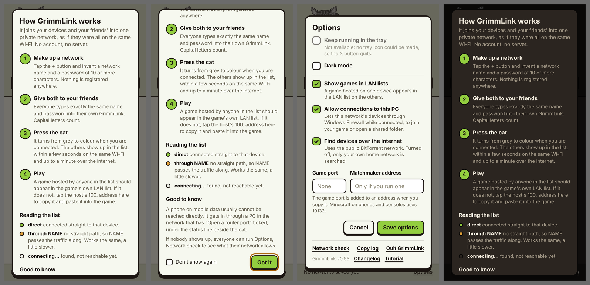

# GrimmLink

A private network for you and your friends, as if everyone were on the same
Wi-Fi. Make up a network name and a password, give both to the people you
want to connect with, and press the cat. No account and no server.

It is built for LAN gaming first: a game hosted on one device shows up in the
LAN list on the others. Anything else that works on a local network works
too, such as shared folders.

## Download

Get the latest build from the [Releases page](../../releases).

| System | File | Notes |
| --- | --- | --- |
| Windows 10 and 11 | `GrimmLink-windows.zip` | Unzip, keep the files together, run `GrimmLink.exe`. `README.txt` inside has the details. |
| Android 8 or newer (64-bit) | `GrimmLink.apk` | Allow installing from your browser or file manager when asked. |
| Ubuntu and other Linux | `GrimmLink-ubuntu.tar.gz` | Command line, with an installer for running as a service. `README.txt` inside. |

## How to use it

1. **Make up a network.** Press + and invent a name and a password of 10 or
   more characters. Nothing is registered anywhere.
2. **Give both to your friends.** Everyone types exactly the same name and
   password into their own GrimmLink.
3. **Press the cat.** It turns from grey to green (or orange in Dark Mode) when you are connected,
   and the others appear in the list.
4. **Play.** A game hosted by anyone in the list should appear in the game's
   own LAN list. If it does not, tap the host's 100. address to copy it and
   paste it into the game.

## What it does

- Finds your friends' devices with nothing in the middle: by broadcast on the
  same Wi-Fi, and through the public BitTorrent network across the internet.
  No files are shared; that network is only used as a meeting place.
- Connects devices directly whenever their routers allow it. Everything
  between them is encrypted with WireGuard.
- Devices introduce each other, and when two cannot connect directly, a
  device connected to both passes their traffic along, still encrypted.
- Carries the "is anyone hosting?" announcements games use, so LAN lists
  fill in. Confirmed with Minecraft Bedrock and SuperTuxKart.
- A PC can ask its router to open a port (UPnP), which lets phones on mobile
  data join through it.
- A network check in Options says what your network allows.

## Good to know

- To your internet provider, GrimmLink can look like a BitTorrent program,
  because it uses that network to find devices. Nothing is downloaded or
  shared. It can be turned off in Options, leaving the local network only.
- Windows asks for administrator rights at every start, because creating a
  network adapter needs them.
- On Android it uses the system's VPN feature. Only traffic to GrimmLink's
  100. addresses goes through it.

## Support

GrimmLink is free. If you like what I am doing here, you can
[buy me a coffee](https://buymeacoffee.com/grimmcreations) or
[support me on Patreon](https://www.patreon.com/c/GrimmCreations).

## Licence

Free to use and to pass on unchanged. Not to be modified or sold. The full
terms are in [LICENSE](LICENSE). [CHANGELOG.txt](CHANGELOG.txt) lists what
changed in each version.

## Credits

Built on [WireGuard](https://www.wireguard.com/) through wireguard-go and, on
Windows, the Wintun driver (licences in the [licenses](licenses) folder). "WireGuard"
and "Wintun" are trademarks of their owners; GrimmLink is not affiliated with
or endorsed by them.
